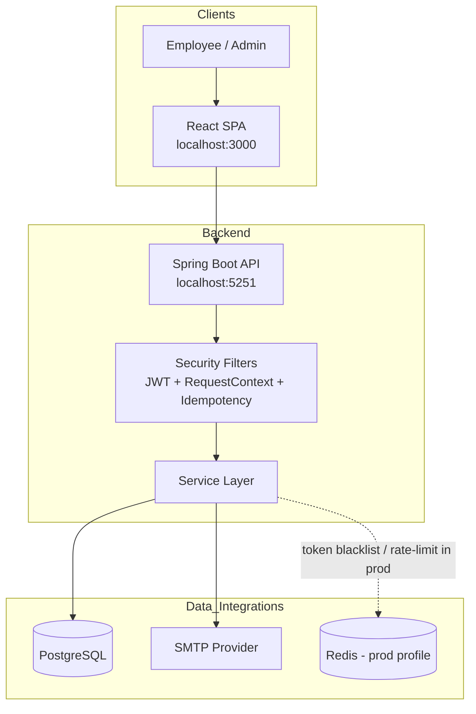
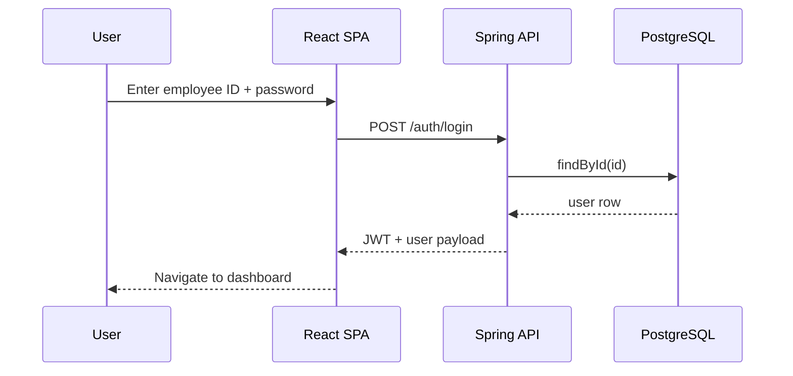
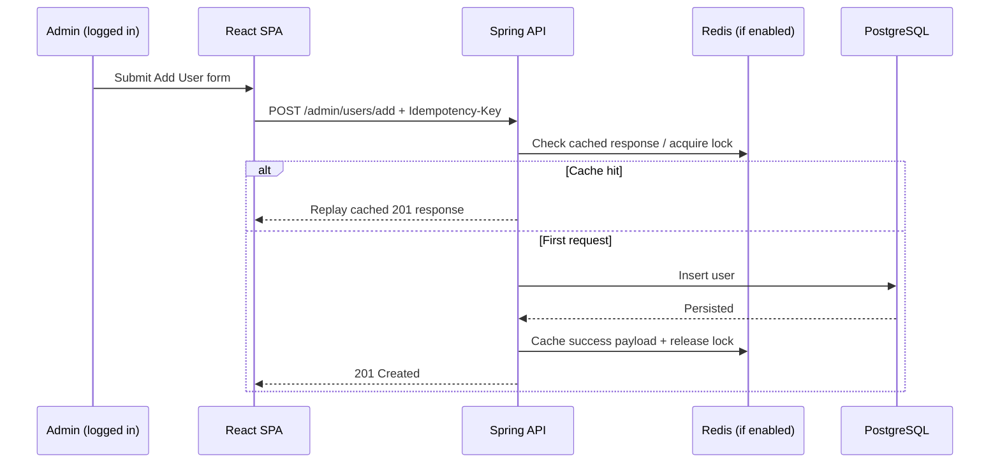

# APSRTC Duty Management Portal

Secure workforce and duty-management platform for APSRTC-style operations, built with a React SPA and a Spring Boot backend backed by PostgreSQL.

<p align="center">
  
  
  
  
  
</p>

## Table of Contents

- [Product Summary](#product-summary)
- [Product UI (Screenshots)](#product-ui-screenshots)
- [Architecture](#architecture)
  - [System Design](#system-design)
  - [Runtime Request Flow](#runtime-request-flow)
  - [Backend Module Design](#backend-module-design)
- [Tech Stack](#tech-stack)
- [Compatibility Matrix](#compatibility-matrix)
- [Repository Layout](#repository-layout)
- [Quick Start (Recommended: Docker)](#quick-start-recommended-docker)
- [Quick Start (Host Run)](#quick-start-host-run)
- [Configuration Reference](#configuration-reference)
- [API Quick Contract](#api-quick-contract)
- [Operational Endpoints](#operational-endpoints)
- [Testing](#testing)
- [End-to-End Smoke Test](#end-to-end-smoke-test)
- [Troubleshooting](#troubleshooting)
- [Production Readiness Checklist](#production-readiness-checklist)
- [Security Notes](#security-notes)
- [Contributing](#contributing)
- [Roadmap](#roadmap)

## Product Summary

This portal supports:

- JWT-based authentication for employees and admins.
- Admin workflows: user onboarding, duty assignment, leave review.
- Employee workflows: current/previous duty views and leave requests.
- OTP-based forgot-password flow.
- Production-oriented backend patterns: Flyway migrations, actuator probes, rate limiting, idempotency for critical admin write paths.

## Product UI (Screenshots)

### Authentication

| Screen | Preview |
|---|---|
| Sign in |  |
| Register |  |

### Admin Workflows

| Screen | Preview |
|---|---|
| Admin dashboard |  |
| Add user |  |
| Add duty |  |

### Profile

| Screen | Preview |
|---|---|
| User profile |  |

Extra screen:
- Pending leave list: 

## Architecture

### System Design



Fallback (plain text):

```text
User -> React SPA (:3000) -> Spring API (:5251)
Spring API -> Security Filters -> Service Layer
Service Layer -> PostgreSQL
Service Layer -> SMTP
Service Layer -> Redis (prod profile only)
```

### Runtime Request Flow (Login)



Fallback (plain text):

```text
User enters credentials
-> React calls POST /auth/login
-> API checks user in PostgreSQL
-> API returns JWT + user details
-> React navigates to dashboard
```

### Runtime Request Flow (Admin Add User + Idempotency)



Fallback (plain text):

```text
Admin submits Add User with Idempotency-Key
-> API checks Redis lock/cache
   - if cache hit: replay previous 201
   - else: write user in PostgreSQL, cache response in Redis, return 201
```

### Backend Module Design

```mermaid
flowchart LR
  subgraph Security
    F1[JwtAuthenticationFilter]
    F2[RequestContextFilter\n(correlation + login rate limit)]
    F3[IdempotencyFilter\n(selected admin writes)]
  end

  subgraph API_Layer
    C1[AuthController]
    C2[UserController]
    C3[AdminController]
  end

  subgraph Business_Layer
    S1[UserService]
    S2[LeaveService]
    S3[DutyService]
    S4[AdminService]
    S5[EmailService]
  end

  subgraph Data_Layer
    R[Spring Data Repositories]
    DB[(PostgreSQL)]
  end

  F1 --> C1
  F1 --> C2
  F1 --> C3
  F2 --> C1
  F2 --> C2
  F2 --> C3
  F3 --> C3

  C1 --> S1
  C2 --> S1
  C2 --> S2
  C2 --> S3
  C3 --> S4
  C3 --> S3
  C3 --> S2

  S1 --> R
  S2 --> R
  S3 --> R
  S4 --> R
  R --> DB

  S1 --> S5
  S2 --> S5
```

### Design Decisions

- **Flyway owns schema**: app uses `ddl-auto=validate` to prevent runtime schema drift.
- **Dev profile simplicity**: no Redis required for local setup; memory implementations keep setup friction low.
- **Selective idempotency**: enabled for high-impact admin POST operations to prevent duplicate writes.

### Runtime Notes

- Frontend dev proxy targets `http://localhost:5251`.
- Backend default profile is `dev`.
- `dev` profile uses in-memory token blacklist/rate limit backend (no Redis required).
- `prod` profile expects Redis and OTLP config.

## Tech Stack

### Backend (`apsrtc-spring/user-service`)

- Java 17+
- Spring Boot 3.5.6
- Spring Security (JWT)
- Spring Data JPA + Hibernate
- Flyway
- Actuator + Micrometer OTLP
- Maven wrapper (`mvnw`)

### Frontend (`apsrtc-react`)

- React 19 (CRA + CRACO)
- React Router 7
- TanStack React Query 5
- Axios
- Tailwind CSS
- MUI / Flowbite

### Data / Infra

- PostgreSQL 16
- Docker / Docker Compose

## Compatibility Matrix

| Component | Version used in this repo |
|---|---|
| Java | 17+ (tested with 21 locally) |
| Maven | Wrapper (`mvnw`) |
| Node.js | Modern LTS recommended |
| React | 19.2.0 |
| Spring Boot | 3.5.6 |
| PostgreSQL | 16 (compose image) |
| Docker Compose | v2+ |

## Repository Layout

```text
APSRTC/
├── README.md
├── docker-compose.yml
├── docs/
│   └── ui/
├── apsrtc-react/
│   ├── package.json
│   └── src/
├── apsrtc-spring/
│   ├── Dockerfile
│   ├── pom.xml
│   └── user-service/
│       ├── pom.xml
│       └── src/
└── .github/workflows/
    └── apsrtc-backend-ci.yml
```

## Quick Start (Recommended: Docker)

### Prerequisites

- Docker Desktop running
- Node.js installed

### 1) Start backend + DB

```bash
cd /Users/krishnakoushikunnam/Documents/Projects/APSRTC
docker compose up --build -d
```

### 2) Verify backend

```bash
curl -s http://localhost:5251/actuator/health
```

Expected:

```json
{"status":"UP","groups":["liveness","readiness"]}
```

### 3) Start frontend

```bash
cd apsrtc-react
npm install
npm start
```

Open `http://localhost:3000`.

### 4) Stop

```bash
docker compose down
```

Reset data:

```bash
docker compose down -v
```

## Quick Start (Host Run)

Use this if you want backend on host and Postgres local.

### 1) Export env vars in one terminal

```bash
export DB_URL="jdbc:postgresql://localhost:5432/apsrtc"
export DB_USERNAME="postgres"
export DB_PASSWORD="<your_real_password>"
export JWT_SECRET="<min_32_char_secret>"
export MAIL_USERNAME="<smtp_user_or_placeholder>"
export MAIL_PASSWORD="<smtp_pass_or_placeholder>"
export PORT=5251
```

### 2) Start backend

```bash
cd apsrtc-spring
bash mvnw -pl user-service spring-boot:run
```

### 3) Start frontend

```bash
cd ../apsrtc-react
npm start
```

## Configuration Reference

| Variable | Required | Purpose |
|---|---:|---|
| `DB_URL` | Yes | JDBC URL for PostgreSQL |
| `DB_USERNAME` | Yes | DB user |
| `DB_PASSWORD` | Yes | DB password |
| `JWT_SECRET` | Recommended | JWT signing secret |
| `PORT` | Optional | Server port (default `8080`) |
| `MAIL_USERNAME` | Required by config | SMTP username |
| `MAIL_PASSWORD` | Required by config | SMTP password |
| `CORS_ORIGINS` | Optional | Allowed frontend origins |

### Profile behavior

- `dev`: no Redis auto-config; in-memory security auxiliaries.
- `prod`: Redis-backed blacklist/rate-limiting and OTLP endpoints.

## API Quick Contract

> Base URL: `http://localhost:5251`

### Authentication

| Method | Endpoint | Notes |
|---|---|---|
| POST | `/auth/register` | Create user |
| POST | `/auth/login` | Login currently expects employee ID field |
| POST | `/auth/forgot-password` | Starts OTP flow |
| POST | `/auth/verify-otp` | Validate OTP |
| POST | `/auth/change-password` | Set new password |
| POST | `/auth/logout` | Blacklists token |

### User

| Method | Endpoint |
|---|---|
| GET | `/user/{id}/current-duty` |
| GET | `/user/{id}/previous-duty` |
| POST | `/user/leave-request` |
| PUT | `/user/change-password` |

### Admin

| Method | Endpoint |
|---|---|
| GET | `/admin/dashboard` |
| POST | `/admin/users/add` |
| PUT | `/admin/users/update/{id}` |
| DELETE | `/admin/users/delete/{id}` |
| POST | `/admin/duties/add` |
| GET | `/admin/leaves/pending` |
| PUT | `/admin/leaves/{id}/approve` |
| PUT | `/admin/leaves/{id}/reject` |

## API Payload Examples

> Examples are representative for local/dev and may include extra fields depending on role and endpoint logic.

### 1) Login (`POST /auth/login`)

Request:

```json
{
  "id": "2026BCS01",
  "password": "yourPassword"
}
```

Response (200):

```json
{
  "token": "<jwt>",
  "user": {
    "id": "2026BCS01",
    "name": "Krishna Koushik",
    "email": "koushik@example.com",
    "category": "ADMIN",
    "district": "Prakasam",
    "depo": "Ongole"
  }
}
```

### 2) Add User (`POST /admin/users/add`)

Request:

```json
{
  "id": "2026DVR99",
  "name": "John Driver",
  "email": "john.driver@example.com",
  "contactNumber": "9876543210",
  "category": "DRIVER",
  "district": "Prakasam",
  "depo": "Ongole",
  "password": "StrongPassword@123"
}
```

Response (201):

```json
{
  "id": "2026DVR99",
  "name": "John Driver",
  "email": "john.driver@example.com",
  "category": "DRIVER",
  "district": "Prakasam",
  "depo": "Ongole",
  "createdDate": "2026-04-02"
}
```

### 3) Leave Request (`POST /user/leave-request`)

Request:

```json
{
  "reason": "Medical leave",
  "fromDate": "2026-04-05",
  "toDate": "2026-04-07"
}
```

Response (201/200):

```json
{
  "leaveId": 101,
  "name": "Krishna Koushik",
  "userId": "2026BCS01",
  "email": "koushik@example.com",
  "reason": "Medical leave",
  "fromDate": "2026-04-05",
  "toDate": "2026-04-07",
  "status": "PENDING"
}
```

## Operational Endpoints

- `GET /actuator/health`
- `GET /actuator/health/liveness`
- `GET /actuator/info`
- `GET /actuator/prometheus`
- Swagger UI: `/swagger-ui.html`

## Testing

### Backend test suite

```bash
cd apsrtc-spring
bash mvnw -B test -pl user-service
```

### CI command path

GitHub workflow runs:

```bash
./mvnw -B verify -pl user-service
```

## End-to-End Smoke Test

After backend + frontend are up:

1. Open `http://localhost:3000`.
2. Create a user via register (or admin add-user).
3. Login with employee ID + password.
4. Verify dashboard loads.
5. Hit `http://localhost:5251/actuator/health` and confirm `UP`.

## Troubleshooting

### `zsh: operation not permitted: ./mvnw`

```bash
xattr -cr .
bash mvnw -pl user-service spring-boot:run
```

### `password authentication failed for user "postgres"`

`DB_PASSWORD` is wrong for that user.

```bash
psql -h localhost -p 5432 -U postgres -d apsrtc
```

Then export the exact password that works there.

### `Cannot find module 'sourcemap-codec'`

```bash
cd apsrtc-react
npm install sourcemap-codec
```

### `/actuator/health` DOWN in Docker

Often mail health with placeholder SMTP creds. Compose sets:

- `MANAGEMENT_HEALTH_MAIL_ENABLED=false`

### Login by email fails

Current backend login resolves user by `id` (employee ID). Use employee ID for now.

## Production Readiness Checklist

- [ ] Replace all local/dev credentials and JWT secret.
- [ ] Restrict `CORS_ORIGINS` to actual frontend domains.
- [ ] Restrict `/actuator/prometheus` at network boundary.
- [ ] Configure real SMTP credentials.
- [ ] Configure Redis and prod profile settings.
- [ ] Configure OTLP exporter endpoints intentionally (or disable).
- [ ] Add backup/restore procedure for Postgres data.

## Security Notes

- Do not commit real secrets.
- Rotate JWT and SMTP credentials in shared environments.
- Use HTTPS and proper reverse-proxy hardening in production.

## Contributing

Before opening a PR:

1. Run backend tests:

```bash
cd apsrtc-spring
bash mvnw -B test -pl user-service
```

2. Run frontend tests:

```bash
cd apsrtc-react
npm test
```

3. Validate Docker bring-up:

```bash
docker compose up -d
curl -s http://localhost:5251/actuator/health
```

## Roadmap

- Support login by employee ID **or** email to match UI copy.
- Add frontend CI workflow.
- Add API examples (request/response payload samples) in docs.
- Add load/perf baseline and SLO targets.
