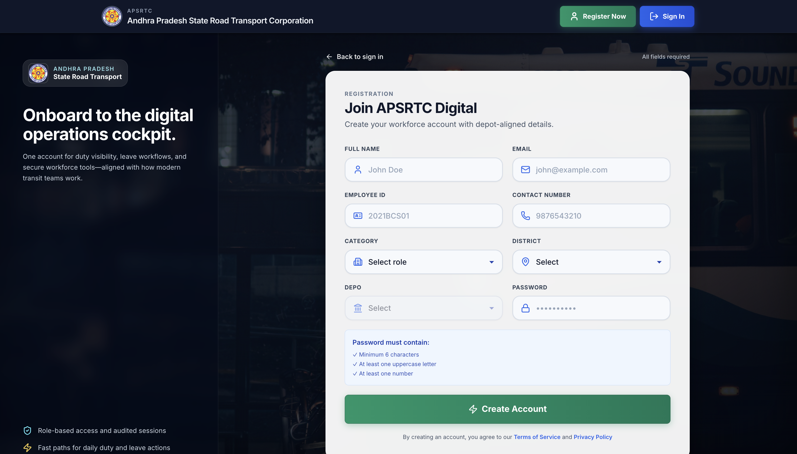
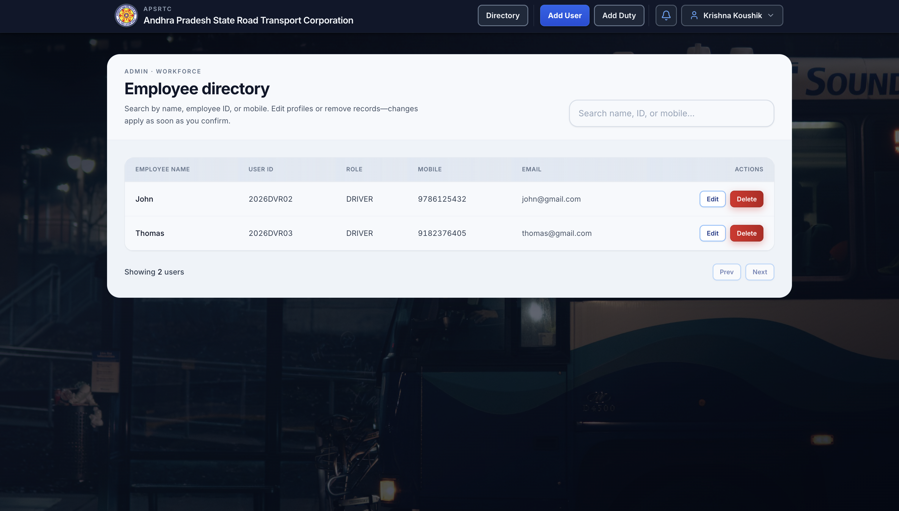
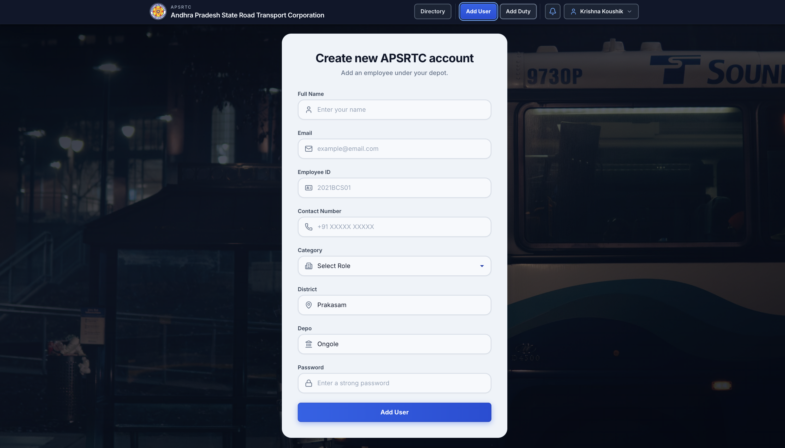
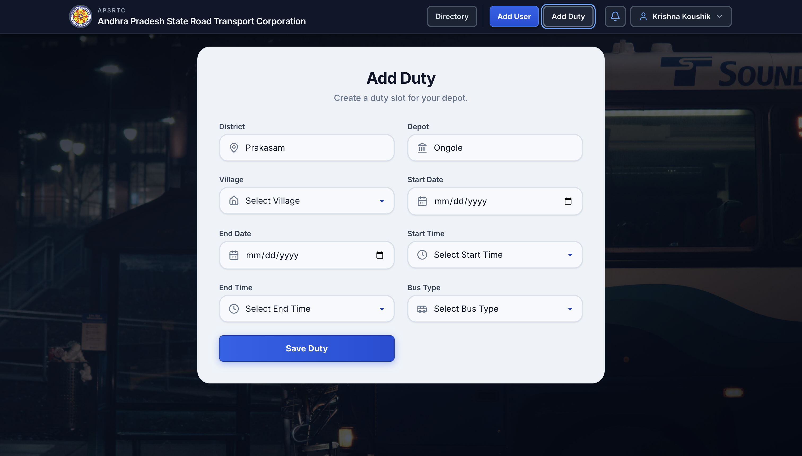
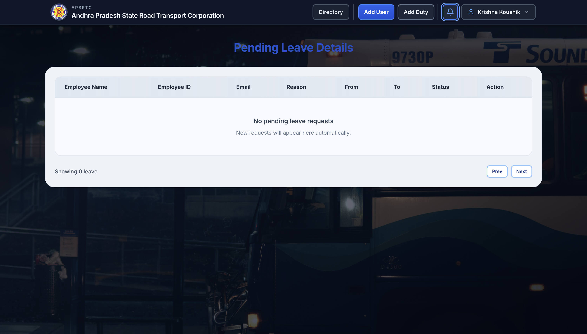
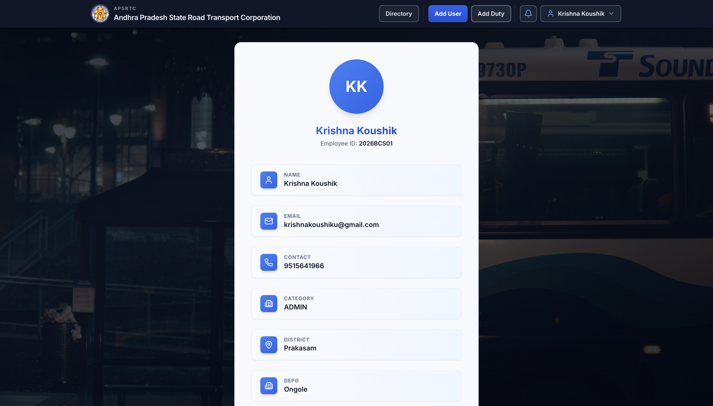
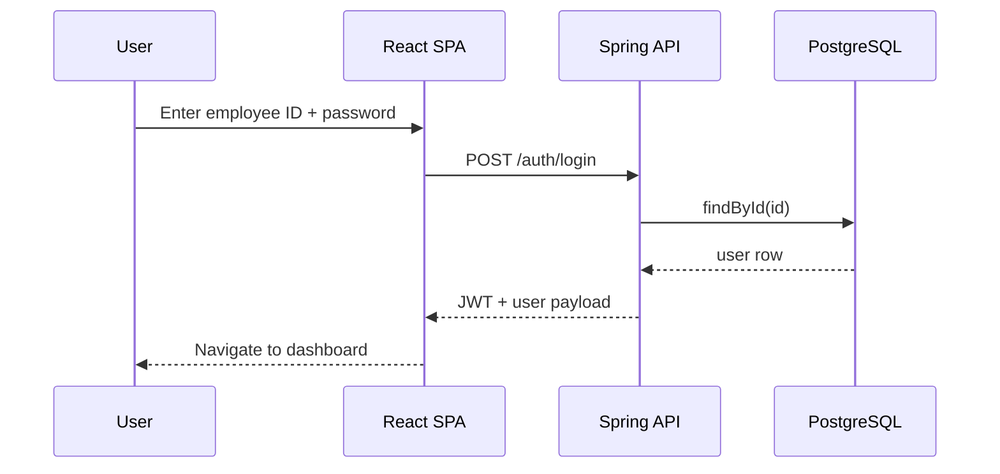
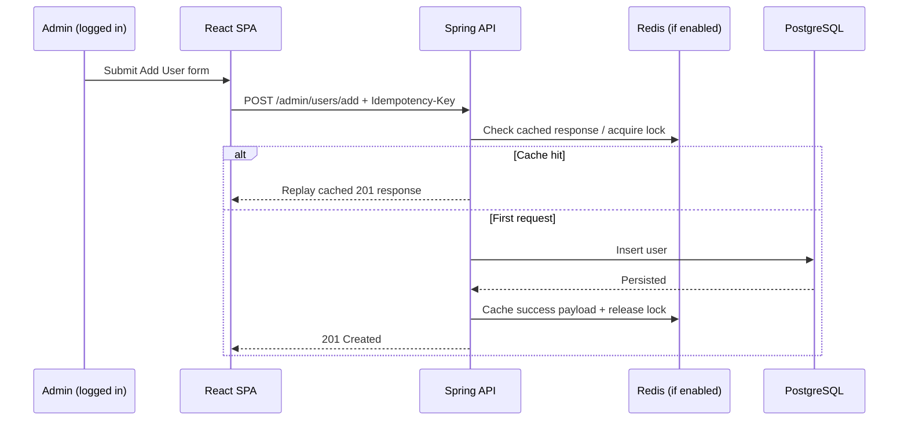
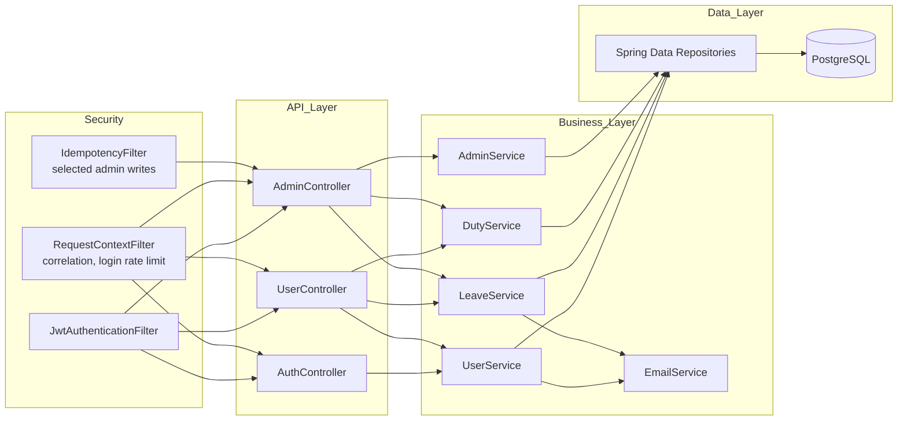

# APSRTC Duty Management Portal

Duty management portal: React SPA, Spring Boot API, PostgreSQL.

<p align="center">
  
  
  
  
  
</p>

Source: [github.com/krishnakoushik225/APSRTC-Duty-Management-Portal](https://github.com/krishnakoushik225/APSRTC-Duty-Management-Portal)

## Table of Contents

- [Run locally](#run-locally)
- [Product Summary](#product-summary)
- [Product UI (Screenshots)](#product-ui-screenshots)
- [Architecture](#architecture)
  - [System Design](#system-design)
  - [Runtime Request Flow](#runtime-request-flow)
  - [Backend Module Design](#backend-module-design)
- [Stack & versions](#stack--versions)
- [Repository layout](#repository-layout)
- [Configuration Reference](#configuration-reference)
- [API Quick Contract](#api-quick-contract)
- [API Payload Examples](#api-payload-examples)
- [Operational Endpoints](#operational-endpoints)
- [Testing](#testing)
- [Troubleshooting](#troubleshooting)
- [Production Readiness Checklist](#production-readiness-checklist)
- [Security Notes](#security-notes)
- [Contributing](#contributing)

## Run locally

You need two processes: the **API** (Docker or your JVM) and the **React dev server** on your machine. The frontend dev server proxies API calls to `http://localhost:5251` (see `apsrtc-react/package.json`).

### Prerequisites

| Path | What you need |
|------|----------------|
| **Docker (recommended)** | Docker Desktop (or Docker Engine + Compose v2), Node.js 18+ |
| **Host JVM** | JDK 17+, Node.js 18+, PostgreSQL you can reach from your machine, Maven via `apsrtc-spring/mvnw` |

### Get the code

```bash
git clone https://github.com/krishnakoushik225/APSRTC-Duty-Management-Portal.git
cd APSRTC-Duty-Management-Portal
```

If you use a fork, clone that URL instead and `cd` into the folder Git creates.

### With Docker (recommended)

From the repository root:

1. **Start API and database**

   ```bash
   docker compose up --build -d
   ```

2. **Check the API**

   ```bash
   curl -s http://localhost:5251/actuator/health
   ```

   You should see JSON with `"status":"UP"`.

3. **Start the UI** (new terminal, from repo root)

   ```bash
   cd apsrtc-react
   npm install
   npm start
   ```

4. Open [http://localhost:3000](http://localhost:3000). Register or log in with an **employee ID** (not email) and password—see [Login by email fails](#login-by-email-fails).

5. **Stop**

   ```bash
   docker compose down
   ```

   Wipe DB volume:

   ```bash
   docker compose down -v
   ```

### With local PostgreSQL + JVM

Use this when you want Spring Boot on your machine instead of the `user-service` container.

1. **Create an empty database** (name `apsrtc`, or change `DB_URL` to match). Example:

   ```bash
   psql -h localhost -p 5432 -U postgres -c "CREATE DATABASE apsrtc;"
   ```

2. **Export environment variables** (match your DB user and password):

   ```bash
   export DB_URL="jdbc:postgresql://localhost:5432/apsrtc"
   export DB_USERNAME="postgres"
   export DB_PASSWORD="<your_db_password>"
   export JWT_SECRET="<at_least_32_characters>"
   export MAIL_USERNAME="<smtp_user_or_placeholder>"
   export MAIL_PASSWORD="<smtp_pass_or_placeholder>"
   export PORT=5251
   ```

3. **Start the API**

   ```bash
   cd apsrtc-spring
   bash mvnw -pl user-service spring-boot:run
   ```

   On macOS, if `./mvnw` fails with “operation not permitted”, use `bash mvnw` after `xattr -cr .` in `apsrtc-spring` (see [Troubleshooting](#troubleshooting)).

4. **Start the UI**

   ```bash
   cd ../apsrtc-react
   npm install
   npm start
   ```

5. Open [http://localhost:3000](http://localhost:3000) and verify [http://localhost:5251/actuator/health](http://localhost:5251/actuator/health).

More env vars: [Configuration Reference](#configuration-reference).

## Product Summary

This portal supports:

- JWT-based authentication for employees and admins.
- Admin workflows: user onboarding, duty assignment, leave review.
- Employee workflows: current/previous duty views and leave requests.
- OTP-based forgot-password flow.
- Backend: Flyway migrations, Actuator health, login rate limits, idempotent admin writes (where enabled).

## Product UI (Screenshots)

### Authentication

| Screen | Preview |
|---|---|
| Sign in |  |
| Register |  |

### Admin Workflows

| Screen | Preview |
|---|---|
| Admin dashboard |  |
| Add user |  |
| Add duty |  |
| Pending leaves |  |

### Profile

| Screen | Preview |
|---|---|
| User profile |  |

## Architecture

### System Design


Fallback (plain text):

```text
User -> React SPA (:3000) -> Spring API (:5251)
Spring API -> Security Filters -> Service Layer
Service Layer -> PostgreSQL
Service Layer -> SMTP
Service Layer -> Redis (prod profile only)
```

### Runtime Request Flow (Login)



Fallback (plain text):

```text
User enters credentials
-> React calls POST /auth/login
-> API checks user in PostgreSQL
-> API returns JWT + user details
-> React navigates to dashboard
```

### Runtime Request Flow (Admin Add User + Idempotency)



Fallback (plain text):

```text
Admin submits Add User with Idempotency-Key
-> API checks Redis lock/cache
   - if cache hit: replay previous 201
   - else: write user in PostgreSQL, cache response in Redis, return 201
```

### Backend Module Design



### Design Decisions

- **Flyway owns schema**: app uses `ddl-auto=validate` to prevent runtime schema drift.
- **Selective idempotency**: enabled for high-impact admin POST operations to prevent duplicate writes.

`dev` vs `prod` behavior (Redis, OTLP) is summarized under [Configuration Reference](#configuration-reference).

## Stack & versions

| Piece | Notes |
|------|--------|
| Java | 17+ (CI/local often use 21) |
| Spring Boot | 3.5.6 |
| Node.js | 18+ LTS for `apsrtc-react` |
| React | 19.x (CRA + CRACO) |
| PostgreSQL | 16 (Docker image in compose) |
| Build | Maven wrapper `apsrtc-spring/mvnw` |

**Libraries:** Spring Security (JWT), Spring Data JPA, Flyway, Actuator + Micrometer OTLP, React Router 7, TanStack Query 5, Axios, Tailwind, MUI, Flowbite.

## Repository layout

```text
APSRTC-Duty-Management-Portal/
├── README.md
├── docker-compose.yml
├── docs/
│   └── ui/
├── apsrtc-react/
│   ├── package.json
│   └── src/
├── apsrtc-spring/
│   ├── Dockerfile
│   ├── pom.xml
│   └── user-service/
│       ├── pom.xml
│       └── src/
└── .github/workflows/
    └── apsrtc-backend-ci.yml
```

## Configuration Reference

| Variable | Required | Purpose |
|---|---:|---|
| `DB_URL` | Yes | JDBC URL for PostgreSQL |
| `DB_USERNAME` | Yes | DB user |
| `DB_PASSWORD` | Yes | DB password |
| `JWT_SECRET` | Recommended | JWT signing secret |
| `PORT` | Optional | Server port (default `8080`) |
| `MAIL_USERNAME` | Required by config | SMTP username |
| `MAIL_PASSWORD` | Required by config | SMTP password |
| `CORS_ORIGINS` | Optional | Allowed frontend origins |

### Profile behavior

- **`dev`** (default for local work, including Docker Compose): no Redis required; in-memory token blacklist and rate limiting; Flyway runs on startup.
- **`prod`**: expects Redis (blacklist, rate limits, idempotency where configured) and OTLP settings if metrics export is enabled.

## API Quick Contract

> Base URL: `http://localhost:5251`

### Authentication

| Method | Endpoint | Notes |
|---|---|---|
| POST | `/auth/register` | Create user |
| POST | `/auth/login` | Login currently expects employee ID field |
| POST | `/auth/forgot-password` | Starts OTP flow |
| POST | `/auth/verify-otp` | Validate OTP |
| POST | `/auth/change-password` | Set new password |
| POST | `/auth/logout` | Blacklists token |

### User

| Method | Endpoint |
|---|---|
| GET | `/user/{id}/current-duty` |
| GET | `/user/{id}/previous-duty` |
| POST | `/user/leave-request` |
| PUT | `/user/change-password` |

### Admin

| Method | Endpoint |
|---|---|
| GET | `/admin/dashboard` |
| POST | `/admin/users/add` |
| PUT | `/admin/users/update/{id}` |
| DELETE | `/admin/users/delete/{id}` |
| POST | `/admin/duties/add` |
| GET | `/admin/leaves/pending` |
| PUT | `/admin/leaves/{id}/approve` |
| PUT | `/admin/leaves/{id}/reject` |

## API Payload Examples

> Shapes only; real responses may include more fields.

### 1) Login (`POST /auth/login`)

Request:

```json
{
  "id": "2026BCS01",
  "password": "yourPassword"
}
```

Response (200):

```json
{
  "token": "<jwt>",
  "user": {
    "id": "2026BCS01",
    "name": "Ada Admin",
    "email": "ada.admin@example.com",
    "category": "ADMIN",
    "district": "Prakasam",
    "depo": "Ongole"
  }
}
```

### 2) Add User (`POST /admin/users/add`)

Request:

```json
{
  "id": "2026DVR99",
  "name": "John Driver",
  "email": "john.driver@example.com",
  "contactNumber": "9876543210",
  "category": "DRIVER",
  "district": "Prakasam",
  "depo": "Ongole",
  "password": "StrongPassword@123"
}
```

Response (201):

```json
{
  "id": "2026DVR99",
  "name": "John Driver",
  "email": "john.driver@example.com",
  "category": "DRIVER",
  "district": "Prakasam",
  "depo": "Ongole",
  "createdDate": "2026-04-02"
}
```

### 3) Leave Request (`POST /user/leave-request`)

Request:

```json
{
  "reason": "Medical leave",
  "fromDate": "2026-04-05",
  "toDate": "2026-04-07"
}
```

Response (201/200):

```json
{
  "leaveId": 101,
  "name": "Jane Employee",
  "userId": "2026BCS01",
  "email": "jane.employee@example.com",
  "reason": "Medical leave",
  "fromDate": "2026-04-05",
  "toDate": "2026-04-07",
  "status": "PENDING"
}
```

## Operational Endpoints

- `GET /actuator/health`
- `GET /actuator/health/liveness`
- `GET /actuator/info`
- `GET /actuator/prometheus`
- Swagger UI: `/swagger-ui.html`

## Testing

### Backend test suite

```bash
cd apsrtc-spring
bash mvnw -B test -pl user-service
```

### CI command path

GitHub workflow runs:

```bash
./mvnw -B verify -pl user-service
```

## Troubleshooting

### `zsh: operation not permitted: ./mvnw`

```bash
xattr -cr .
bash mvnw -pl user-service spring-boot:run
```

### `password authentication failed for user "postgres"`

`DB_PASSWORD` is wrong for that user.

```bash
psql -h localhost -p 5432 -U postgres -d apsrtc
```

Then export the exact password that works there.

### `Cannot find module 'sourcemap-codec'`

```bash
cd apsrtc-react
npm install sourcemap-codec
```

### `/actuator/health` DOWN in Docker

Often mail health with placeholder SMTP creds. Compose sets:

- `MANAGEMENT_HEALTH_MAIL_ENABLED=false`

### Login by email fails

Current backend login resolves user by `id` (employee ID). Use employee ID for now.

## Production Readiness Checklist

- [ ] Replace all local/dev credentials and JWT secret.
- [ ] Restrict `CORS_ORIGINS` to actual frontend domains.
- [ ] Restrict `/actuator/prometheus` at network boundary.
- [ ] Configure real SMTP credentials.
- [ ] Configure Redis and prod profile settings.
- [ ] Configure OTLP exporter endpoints intentionally (or disable).
- [ ] Add backup/restore procedure for Postgres data.

## Security Notes

- Do not commit real secrets.
- Rotate JWT and SMTP credentials in shared environments.
- Use HTTPS and proper reverse-proxy hardening in production.

## Contributing

Before opening a PR: run the [Testing](#testing) commands, `npm test` in `apsrtc-react`, then `docker compose up -d` from the repo root and confirm `GET http://localhost:5251/actuator/health` returns `UP`.
